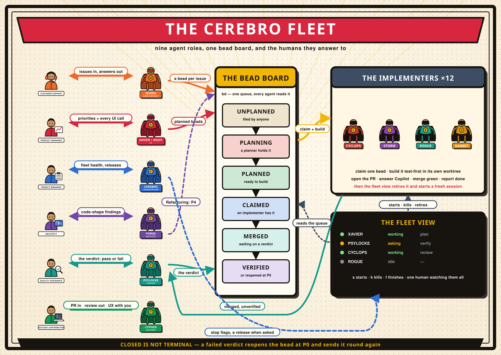

# Running the agent workflow

This is the human's guide to running the fleet: what to start, what each agent will ask you for,
where to look when something wants you, and what it costs. You are "the navigator" throughout — the
agents' word for the one person every user-facing decision belongs to.

The agents' own instructions live in `.claude/cerebro/agents/<role>.md`, and for the three roles that
have one, in `.claude/cerebro/skills/`: `plan-bead`, `implement-bead` and the shared
`beads-workflow` — and `project-definition`, which no role loads: you run it yourself, once, in a
blank repository (the README says when). The verifier, the reviewer and the architect carry their
whole job in their agent file. You do not need to read any of it to operate this.



*The whole thing on one page. Regenerate with `python3 docs/cerebro-fleet.py` when a role or a flow
changes — the SVG is generated, not drawn by hand.*

## The idea

Work is tracked in **beads** (`bd`), not in GitHub issues. A bead moves through the fleet one label
at a time, and each handover is a label rather than a conversation:

```
  unplanned ──► planning ──► planned ──► claimed ──► merged ──► verified
                   │            │           │           │           │
              a planner    ready for   an implementer  a PR    Psylocke and
              holds it     anyone      is building it  merged  you looked at it
                   └──────────── needs you ◄───────────┘
```

Two rules hold that together, and both are load-bearing:

- **A planner never claims.** Claiming means *an implementer is building this*. A planner takes the
  `planning:<its own name>` label instead, which says the same thing about planning while leaving the bead open,
  unassigned and free for anyone to pick up if that session dies.
- **Closed is not terminal.** A failed verification reopens a bead at P0 and sends it round again.

## Who is in the fleet

Seven roles. Six are interactive sessions you talk to; the seventh is the implementer, of which
there are twelve on the roster.

| Agent | Role | Runs on | What it is for |
|---|---|---|---|
| **Xavier**, **Beast** | `planner` | Opus / high | Turn unplanned beads into plans an implementer can build unattended |
| **Cerebro** | `orchestrator` | Opus / medium | Watches the fleet, reports on it, ranks the backlog with you, stops implementers, hands a release request to the project's release skill |
| **Moira** | `user-feedback` | Sonnet | Owns the GitHub issue inbox: acknowledges, triages into beads, keeps reporters told |
| **Psylocke** | `verifier` | Sonnet | Puts merged work in front of you and records your verdict |
| **Cypher** | `reviewer` | Opus / high | Reviews pull requests that came from outside the fleet |
| **Forge** | `architect` | Opus / xhigh | Reads the shape of the codebase and files what it is costing |
| twelve X-Men | `implementer` | Sonnet | One planned bead each, built test-first, to a merged PR |

`scripts/roster` is the one declaration of that list — name, role and kind, one line each. Everything
else derives from it: the fleet view, the launcher, and the state files.

## The fleet view is the console

```
.claude/cerebro/scripts/cerebro   # from a terminal, in a fresh Emacs
M-x cerebro                       # in your own
```

Everything below can be done from a terminal, and almost nobody does. The Emacs fleet view lists
every agent on the roster with its state, the bead or PR it is on, and how long it has been there.

**The view your project declares is the one that operates the fleet**: every key below, every
trigger, every stop flag and every state file deleted belongs to whichever it is. Both views offer
the same keys and answer the same tables; this repository declares `tui`, so here they are the
terminal view's — `.claude/cerebro/scripts/cerebro-tui`, under *Watching without interfering*,
which shows the same rows and the same queues. `docs/cerebro-supervision.md` is how supervision
moves either way.

Which of the two may act is now the project's own declaration rather than a property of the
programs: `fleet_supervisor emacs|tui` in `.cerebro/project.conf`, absent meaning `emacs`. Leave it
out and everything below is exactly as it has always been. Whichever view is not the declared one
reads and draws and does nothing else — it says so on its mode line or in its header — and only one
process can hold the lease at a time even when two Emacsen are open on one checkout.

| Key | Does |
|---|---|
| `s` | start the agent on this row, in an Emacs-owned `vterm` session |
| `k` | kill it, confirming harder when it is mid-bead |
| `f` | tell an agent to finish — an implementer completes its bead, an interactive role its pass, and neither starts again until you press `s` |
| `RET` | focus the detail window, to type to the agent shown there |
| `TAB` | cycle list → beads → detail → list |
| `n` / `p` | next / previous row |

Under the list, the **bead panel** answers the questions you actually ask about the queue — Claimed,
Planned unclaimed, Being planned, Unplanned, Merged unverified — with `0`–`4`, `+`/`-` and `u` to
re-prioritise a bead on the spot, and `x` on a **Sweeps** finding to run the exact `bd close` or
`bd reclaim` it maps to, after confirming.

Two things it does for you without being asked: it starts `prune-worktrees.sh --watch` alongside the
buffer (see *Leftover worktrees*), and it ends an implementer that reports `waiting` — its buffer
kept — and starts a fresh one when a planned bead exists, at most one implementer every 30 seconds.
It runs the **interactive roles** exactly the same way: a role that writes `waiting` is ended half a
minute later — its buffer kept, `RET` shows it — and started fresh when its trigger fires: a planner
when the planned buffer is short or a P0 is unplanned;
Psylocke when a merged bead is unverified or a verdict is stale; Moira when an issue moved on GitHub
or a bead linked to one (`gh-<n>` in its `external_ref`) changed since her last pass, Cypher when an
outside PR moved, both hourly regardless; Forge hourly too; an implementer when a planned,
unclaimed bead exists; Cerebro when an unranked bead appears — an idle, running Cerebro is typed a
line naming the beads instead, and again every ten minutes while they stay unranked. A role you have not started this Emacs is never started: `s` (or
`autostart` or `standby` in `roster.conf`) arms it — `standby` arms without starting, so the row
reads `standby` from the moment the view opens and the trigger is what starts it — `k` and `f`
disarm it, and none of that is written to any
file. `cerebro-wake-intervals` is the floor between two starts of one role, changeable while the
fleet runs — **the planners have none**: a short buffer is the fleet already idle, so they start on
the next five-second tick. What keeps that from looping over a trigger no pass can clear is two
comparisons rather than a clock: the counts leave out what is parked in your queue (`human`,
`triage:declined`), and a role is not started again while its trigger names exactly the work its own
last pass was started for. Anything that moves — a bead arrives, one is planned, an implementer
comes up — starts the next pass at once.

**Reading a row.** Green `●` is working, blue `◆` is idle, yellow `◐` is an agent `waiting` between
passes — an implementer between beads included — and it is ended within half a minute; blue `◌` is
**standby**: the view ended this agent after its pass and starts a fresh one when the trigger in the
For column fires, and `RET` shows its last pass. A bold yellow `?` is an agent waiting on
*you*, and grey `○` is dead.

`◌` on an **implementer** row is one whose session died without finishing a bead. The view starts it
again on the same backoff a role waits out, and the For column says when and how many starts have
come to nothing — `↻ retry now`, `↻ retry in 2m, 3 failed`. `k` leaves it down, `s` starts it now and
clears the count, and `f` says as much rather than writing a flag nothing would read. A stop flag
written before it died still means *no further bead*: it is retired instead of retried.

**A standby row under a stop flag reads `■ told to finish`** — an implementer or a role, since
cb-sxf — and the view does not start it, whatever its trigger says; `RET` says so in as many
words rather than promising a return. `s` clears the flag and starts it, saying
`<Name>: cleared a stale stop flag`, and `f` offers to clear it instead of refusing, which is the
cheap way back to *actually, keep going*. A name disarmed on a tick is not started on that same
tick either.

A dead row with a red `✗ …` in the Bead/Phase column is a session that died on its own — most often
a launcher that refused, and the line is the reason it printed, an implementer included. The view
does not start that name again, however it is armed, until you press `s`; `RET` shows the whole
line.

The State column names the
**phase**: `build`, `gate`, `review`, `ci`, `rebase`, `merge` for an implementer; `plan` for
a planner; `prepare`/`verify` for Psylocke; `read`/`check`/`walk`/`report` for Cypher; `sweep` for
Moira and Cerebro (`release` and `triage` too); `daily`/`weekly` for Forge. The Bead/Phase column shows both
timers — time on the bead, time in this phase — so one in `ci` for an hour says something is
stuck. `review` is the implementer waiting on a sub-agent it spawned itself — delta rounds run about a
minute, a cold read the better part of ten — so a row sitting in it much past that says the
sub-agent is expensive, has hung, or never reported back. That last is the one failure mode the
skill accepts: the session is alive and its claim is safe, but only you will notice.

A yellow ` ×2` after the state means two sessions of that name are running in this fleet — one of
them was started outside the view — and `s`, `k` and `f` on that row name both pids instead of
acting until you have ended the extra one from its own terminal.

` gh?` on a standby row means `gh` did not answer the fleet view — Moira and Cypher then
come back hourly only, until it does.

A row is only as alive as its process: the state file's pid must still be running **and** its command
line must still name that agent. Pids get recycled, and a state file left behind by a finished
session used to come back green hours later once the operating system handed its number to something
else.

## Starting an agent

Every session starts the same way, whatever the role:

```bash
.claude/cerebro/scripts/launch <Name>          # every agent, by its own name
```

`launch` is the one place a session is born. It stamps the session with that agent's own `bd`
identity (so two implementers cannot silently claim as one another), re-syncs the skill and agent
symlinks, reads the model and effort from the agent's own definition, turns on Remote Control so you
can steer the session from claude.ai or the Claude app, and installs the hooks that keep the state
file honest while an agent has a question open. Pressing `s` in the fleet view runs exactly this. It refuses, with the pid, to start a name whose
session is already running in this fleet; end that one first.

**Changing what the fleet runs on** is one file, and it lives in *your project* rather than inside
the `.claude/cerebro` submodule — so no other consumer of the harness inherits it — commit it
to give every clone the same fleet, or ignore it to keep it yours. Copy `.claude/cerebro/models.conf.example` to `.cerebro/models.conf` and uncomment a
line. Keys are an agent's name, a role, or `default`, most specific first, so `default fable` moves
everybody and `Beast sonnet` moves one planner — which is the cheap way to compare two models on the
same queue. It takes effect at the next launch; a session already running keeps the model it started
with, and the launcher says which key it matched when it starts one.

## Starting a planner — there are two of them

**Xavier and Beast both hold the planner role** (`scripts/roster --role planner`). One planner keeps
about two implementers fed; a wider fleet outruns a single planning session, which is what the second
one is for. Run one or both — nothing breaks with only Xavier up, the buffer simply refills at half
the rate, and Cerebro will say so on its sweep.

What they divide, and how:

- **Candidates**, by the `planning:<name>` label — and a whole split family by a `planner:<name>`
  label on its parent, since one design shared between children is worth one planner. A hold is read
  as the word `planning`, or the word and a `:` and the holder's name, so the bare label an older
  session writes still counts and an unrelated label starting the same way does not. A planner names the bead in its own state file, takes the
  label, and pushes at once — in that order, so the other planner can tell a live candidate from an
  abandoned one. If a planning session dies, the label is all it leaves: no lease, nothing to
  reclaim.
- **Abandoned labels**, at the top of every pass. A labelled bead is excluded from every candidate
  query, so a label left by a killed session is *lost* work rather than pending work. Each planner
  frees, on every pass and every wake-up, any `planning:` label that no live planner names in its own
  state file, and says which it freed. Three beads sat stranded for a day before this existed. You
  can see them yourself in the fleet view: **Being planned** populated with both planner rows idle is
  the shape of it.
- **The buffer**, by counting `planned` beads only — what an idle implementer could actually claim
  (`scripts/planner-buffer --count` is the number both the planner and the fleet view are reading).
  Both planners may therefore fill at the same time, which is what a second planner is *for*; the
  overshoot is at most one bead each. Counting held beads too was tried and starved the queue: two
  held candidates were enough to make a small fleet's target look met, and both planners slept over a
  queue of two.

**Two planners is two sessions asking you questions.** That is the cost, and it is the thing to watch
before adding the second: if Xavier's row spends most of its time on `asking` rather than `working`,
the queue is bounded by your answers, and a second planner adds a second row waiting on you rather
than more plans. If he is mostly `working`, the second one buys you throughput directly.

A pass runs in this order: free abandoned labels, plan every unplanned P0 whatever the queue looks
like, then — if the planned, unclaimed count is below the number of implementers on the roster
(minus any told to finish), and never fewer than two — plan **one** bead, and end the pass. There is no interval to wait out: if the buffer
is still short the fleet view starts the next session within seconds, against a board that has moved
rather than a planner's memory of it.

**It will interrupt you**, and this is the part worth your attention. Anything the audience sees —
layout, wording, what a control is called, what happens on a click — is yours to decide, not the
agent's. It will propose, usually with a self-contained HTML mockup you can open in a browser, and
wait for you to choose. Architecture, file layout, test shape and ordering it decides by itself.

If you walk away mid-question, it parks that bead with a `human` label and moves to one with no
user-facing surface, so the queue keeps filling. It will not guess on your behalf.

## Starting builders

**You** start builders — one session each, `s` in the fleet view or `launch <Name>` in a
terminal — unless their `.cerebro/roster.conf` line says `autostart`, in which case `M-x cerebro`
starts them for you as it opens. `standby` on an implementer row arms it without starting it, and a
planned, unclaimed bead is what starts it. There is no flag that puts a running implementer to work: **a
running implementer is a working one**, and it claims the next planned bead as soon as one exists. If you want another
builder, start another session.

Implementers are named after X-Men — Cyclops, Storm, Wolverine, Rogue, and on down the roster — so
that a fleet of them can be talked about without anyone counting session hashes.

Each takes a planned bead, creates its own git worktree, works through the plan test-first, opens
a PR, spawns a reviewer sub-agent and answers what it finds, waits for CI, merges and cleans up.
Then it reports itself `waiting` and **that session ends**: the fleet view keeps its buffer and
starts a fresh one under the same name when there is another planned bead. They run on Sonnet,
each with its own context.

The replacement is the point. One bead fills a session with a plan, a diff, a review and three CI
runs, and nothing can clear that from the inside — so instead of clearing it, the session is thrown
away and a clean one takes the next bead.

They are interactive sessions, so you can watch one work and type to it. If it hits a question only
you can answer it will ask, and show as `asking` in the fleet view. Answer it and it carries on. If
you are away, it is told to give up after fifteen minutes (`cerebro-answer-timeout`, 900 seconds) and
hand the bead to your queue instead — so a fleet left alone overnight drains the queue rather than
sitting blocked on you.

**Two or three is a sensible number on one machine.** More is not faster: every merge makes every
other open PR stale, and where the branch protection sets `strict` each of them pays for a `BEHIND`
catch-up and a fresh CI run — and CI is
where the browser suites actually run now, in parallel jobs implementers no longer serialize behind
locally. The orchestrator will say so if you ask for more, once, and then do as it is told.

### The orchestrator

**Cerebro** is one interactive session that watches the fleet, reports on it, stops implementers, and
hands a release request to the project's own release skill. It starts nothing — not even an implementer, because starting one means starting a
session, and only you can do that. The fleet view starts it, or types into it, for an unranked bead
and for nothing else (cb-5lx.2).

```bash
.claude/cerebro/scripts/launch Cerebro
```

Then you talk to it in whatever words you like:

```
how are they doing?
what is waiting on me?
take Storm down
cut a minor release
```

It is called Cerebro because it finds the mutants and points them at the work. Since the fleet view
took over the timed sweeps, what is left for a Cerebro session is ranking the unranked backlog with
you, handing a release request to the project's release skill, diagnosing a stuck implementer, and
anything needing a forced reassignment — which is why most days you will not run one
at all.

### What "take one down" means

It means *finish*, not *stop now* — for a builder mid-bead. Pressing `f` in the fleet view (or asking
Cerebro) writes a stop flag; for one that has claimed something it is read when the implementer
reports `waiting` — bead merged, closed, worktree gone — and no fresh session starts in its place.
So a builder that has just claimed something will be a while yet. That is deliberate: killing one
mid-bead leaves a claimed bead, a worktree and an open PR for you to unpick by hand. An **idle**
builder — between beads, nothing claimed — is the one exception: it stops at once, since there is
nothing in flight to strand.

The implementer never reads the flag itself, and cannot end itself either. It says its pass is over; the
fleet view decides whether a replacement starts.

Changed your mind before it noticed? `f` again offers to clear the flag, or:

```bash
rm .cerebro/state/<name>.stop
```

— or just press `s`; a stale flag is cleared on start.

If you genuinely want one gone this second, `k` — and then you have that cleanup to do.

### What the builders learned

An implementer that hit something unexpected writes it up before it merges, as
`docs/retrospectives/<bead id>.md`, riding in on that bead's own PR. Only surprises go in — a bead
that went to plan leaves no file — so everything in that directory cost somebody time:

```bash
ls docs/retrospectives/ 2>/dev/null || echo "nothing recorded yet"
```

Each file says what happened, why if the agent established it, what it cost, and the specific change
that would prevent it. Agents record; they do not act on these — changing the rules, the skills or CI
is yours. Read the *Seen before* line: a finding on its third bead is one the fleet keeps paying for.

They are committed, so they survive the machine and the session that wrote them. That is why they
live under `docs/` rather than beside the state files in `.cerebro/`, which is gitignored as live
state.

### Leftover worktrees

Agents work in `.cerebro/worktrees/<bead>` and remove the tree when they finish. One that crashes, or
whose bead somebody else merged, leaves it behind — and a stray tree holding `main` makes the next
agent's `git checkout main` fail for no visible reason.

**The fleet view sweeps them**: opening `M-x cerebro` starts `prune-worktrees.sh --watch` in the
background, which prunes every ten minutes for as long as the buffer lives. You can run the same
sweep yourself at any time:

```bash
.claude/cerebro/scripts/prune-worktrees.sh --dry-run   # say what would go
.claude/cerebro/scripts/prune-worktrees.sh             # actually go
```

It only removes a worktree when **nothing can be lost from it**: the tree is clean, the work is
already on main, and nothing has touched it for half an hour. Anything else it keeps and tells you
why. Note that it asks GitHub whether the branch's PR merged, rather than looking for its commits on
main — with `--squash` merges the commits are never there, so the naive check would keep every
worktree for ever.

Creating one is owned too: `scripts/prepare-worktree` is the single recipe every role uses, because
`git worktree add` does not initialise the `.claude/cerebro` submodule and five implementers hit
exactly that before the step had an owner.

### When a builder gets slow or vague

An implementer's context grows with every bead it finishes, and nothing can clear it from the inside.
It is told to re-read plans rather than recall them, and to tell you when it starts to feel the
weight. When it does — or when its reports get woolly — take it down and start a fresh one. That is
the cure, and it is why the fleet is yours to manage rather than automatic.

## The issue inbox

GitHub issues are the **external** inbox — everything from outside the fleet — and **Moira** owns
them:

```bash
.claude/cerebro/scripts/launch Moira
```

One pass over the open issues, then a ten-minute sleep, then another. On each pass she acknowledges
anything new so a reporter is never left wondering whether it arrived, brings you each issue that has
no bead yet with a recommendation — bead, question to the reporter, or close — and for the ones that
do have a bead, brings the issue's status comments up to date with what the bead is actually doing,
closing anything that has shipped.

She never plans and never implements: what leaves her hands is a bead at P4, unranked, for a planner
to triage with you like anything else. She is the only agent that speaks to people outside the
project, which is why the wording of what she posts is hers to get right and yours to correct.

## Reviewing what comes from outside

Anyone can open a pull request. The fleet's own work is planned, built, reviewed before merge by a
sub-agent the implementer spawns, and merged by the implementer that built it — none of which
applies to a contributor who holds no bead and has read none of that. **Cypher** is the path for those:

```bash
.claude/cerebro/scripts/launch Cypher
```

One session, interactive, and it works a PR at a time:

- **It picks up open, non-draft PRs whose author is not you**, and re-reviews one when its head sha
  changes — a contributor who pushes a fix is asking for another look, one who pushes nothing is not.
- **It reads the diff before it runs anything.** An external branch is untrusted code: `pnpm install`
  runs lifecycle scripts, a test file executes, `build.rs` executes, a workflow change runs in CI. If
  the PR touches any of those, Cypher asks you before building, and it builds only in its own
  worktree.
- **It reviews on five questions**: does the change do what it says, does it fit the architecture,
  are the regression tests enough (would they have failed before the change), what does it cost the
  application and the CI, and the rest a reviewer owes a project — dependencies, secrets, error
  handling, docs, scope.
- **It shows you every user-visible change, running.** Same discipline as Psylocke: prepare
  everything first, warm the build, check the port, ask whether you are ready, brief you, launch, and
  record your verdict in your words. A PR that touches nothing the audience sees skips this in one line.
- **It posts one review comment per pass** — never an approval, never a merge, never a push to the
  contributor's branch — ranked so a defect and a naming preference are not the same class, and then
  tells you what it recommends. **You merge.**

Psylocke is unchanged by this: she verifies merged beads against their acceptance criteria, which is
a different question from whether a stranger's PR should land at all.

## Starting a verifier

Every step so far — plan, build, review, merge — is an agent judging its own work, and since the
review became a sub-agent the fleet spawns for itself that is truer than it was, not less. Nothing
checks that the merged result actually does what it was supposed to, until **Psylocke**:

```bash
.claude/cerebro/scripts/launch Psylocke
```

She walks beads closed since her last pass, works out on her own which ones touched anything the audience
could see — a change to `.claude/`, `docs/`, or CI is marked and skipped without ever bothering you —
and for the rest, prepares everything she can before she asks for your time: what the bead claimed,
which shell to launch (web or desktop), which fixture report to load, and what you should look for.
A project that declares `verification none` in `.cerebro/project.conf` has told her there is
nothing to launch at all, and she marks every merged bead as needing no look, saying so in one line
per pass.

**She only ever asks when she is ready to hand you something to run.** Say yes and she briefs you,
launches the app and waits for one of three verdicts:

- **Passed.** The bead is marked verified and that is the end of it.
- **Passed, with a follow-up.** It works; something small about it is worth a look later. She files
  that as an ordinary new bead — unranked, for Cerebro to rank with you next time round — and
  still marks the original passed.
- **Failed.** She reopens the bead **at P0**, records what you saw, and asks one more thing: was the
  *plan* wrong, or was the *build* wrong? A build failure goes straight back to the implementers as
  ordinary rework against the same design. A plan failure goes to a planner first, who reads what you
  saw and revises the existing design rather than starting from nothing.

If you are not free when she asks, the bead simply waits — nothing is blocked, and she offers it
again next pass rather than escalating it to your queue.

**A bead she cannot verify does not block anything.** An unverified bead never stops a release; when
the orchestrator cuts one, it names whatever has not yet had a person look at it and leaves the
decision to you. Verification is information, not a gate.

**What it costs**: a few minutes of your time per bead, on top of whatever it took to build one in
the first place — starting the app, loading the report she names, and telling her what you saw. She
sleeps **five minutes** between passes, so a bead that merges while you are at lunch is offered soon
after you are back.

She verifies in her own worktree, `.cerebro/worktrees/psylocke`, reset to `origin/main` immediately
before every use — never the shared checkout, and never a build started before she fetched. Every
pass fetches before it looks for candidates, so a bead merged from another machine is offered on the
next pass rather than never. She tells
you the sha she is about to build before she ever asks you to look at anything, and if a port she
needs is already serving something, she refuses to reuse it rather than risk verifying against a
build that is not the one that merged. When a verification is later found to have judged the wrong
build, she writes a retrospective of her own, the same way an implementer does.

## Starting the architect

Nobody else in the fleet reads the *shape* of the code. A planner plans one bead, an implementer
builds one bead, a review sub-agent reads that one diff, Psylocke checks that one merged bead does
what it claimed — and across fifty merges nobody asks whether the codebase got harder to change
along the way. **Forge** is that reader:

```bash
.claude/cerebro/scripts/launch Forge
```

Unlike every other interactive session here, Forge does **one sweep and stops** — it works out for
itself whether this is a daily sweep (what merged since its last one) or a weekly one (the whole
codebase), reads accordingly, and then ends its own turn once it has reported. There is no loop to
end and no flag to set: when it says the sweep is finished, end the session with `k` in the fleet
view, same as any other agent you are done with.

Start it whenever you want a read — each morning is a reasonable habit, or any time you want to know
whether recent work left something worth revisiting. It costs you nothing until triage: what it finds
becomes an ordinary `Refactoring:`-titled bead at P4, unranked, for the planners to bring to you like
anything else in the backlog. Forge never fixes anything itself, and it only files a finding that
names a cost already being paid today — a defect fixed twice in the same place, a change that had to
touch several files, a retrospective that names a structural reason something cost time — never a
bare principle or a "could be cleaner."

Its watermark (the last commit it read, and the date of its last weekly sweep) lives in bd memory
rather than in the checkout, so it survives a lost or replaced machine:

```bash
bd recall forge-watermark
bd recall forge-weekly
```

## What the fleet wrote down

Three logs, all under `.cerebro/state/`, all git-ignored and local to this machine.

**`errors.jsonl`** is the first one to open when something did not happen. One line per thing that
went wrong, naming the part of the view it came from:

```bash
tail .cerebro/state/errors.jsonl
{"event":"error","ts":"2026-08-25T09:47:03Z","context":"autostart",
 "message":"vterm is not installed, so nothing was autostarted"}
```

Everything the fleet view used to say once in the echo area and then lose — an autostart that
started nothing, a roster it would not parse, a launcher that refused, a `bd` or `gh` that would not
answer, one agent whose session could not be replaced — lands here as well as there. It stays short:
in a fleet that is working it never gets a line.

Three contexts name a start that did not work, and they are worth telling apart (cb-ccl):

- `launch <Name>` — the launcher's own refusal, written by `scripts/launch-refused` rather than by
  the view. This is what the whole fleet being unable to start looks like: on 2026-08-26 the
  preflight refused every launch for a day with a precise line on stderr, vterm never drew it before
  the session died, and nothing anywhere kept it.
- `session <Name>` — a session that exited abnormally and the launcher did not account for. The
  message carries the exit code and the last line it printed, or says it printed none.
- `start <Name>` — the view has stopped retrying that name, after `cerebro-give-up-after` (5) starts
  in a row that produced no pass and no reason. `s` is the way back.

**`transitions.jsonl`** is the agents' own: one line every time any of them writes its state
(`scripts/agent-state`), carrying `from`, `to`, `phase`, `bead` and `pid`. `scripts/fleet-history`
turns it into durations — how long a bead was held, how long anyone waited at `asking`, what is
unusual this week:

```bash
.claude/cerebro/scripts/fleet-history --summary --since 24h
.claude/cerebro/scripts/fleet-history --json --agent Cyclops
```

**What it cost** is the same log joined to the other record a session leaves behind. Every Copilot
session prints its AI-credit cost as it ends and is then gone; `~/.copilot/session-store.db` keeps
the per-request numbers, turn 0 of each session carries cerebro's own marker sentence naming the
agent and the root, and `transitions.jsonl` says which bead that agent held at the time. So
`scripts/fleet-cost` can answer afterwards, with nothing captured while a session runs:

```bash
.claude/cerebro/scripts/fleet-cost --by-bead --since 7d
.claude/cerebro/scripts/fleet-cost --by-bead --phase
.claude/cerebro/scripts/fleet-cost --by-agent --since 30d
.claude/cerebro/scripts/fleet-cost --bead cb-ue0
```

Two of its columns are the ones worth knowing about before you read a total. **`no bead` is about a
third of the fleet's spend** — an orchestrator holds none by design, and every pass spends before it
claims anything — so it sits below a rule with a row of its own rather than being tidied away.
**`UNPRICED`** counts requests the store records no cost for (a couple of per cent, and every
request on some models); they are excluded from the sums, and the count is **per row**, so an
agent whose whole contribution to a bead was unpriced reads `0.0` beside a number there rather than
looking free.

**`decisions.jsonl`** is the fleet view's, and it answers the other half: not what the agents did but
what Emacs decided about them. One line per start (with the trigger that fired and whether it was a
trigger or you), per end, retire and nudge, per sweep finding run, per triage line typed, per
abnormal exit — and,
at the default verbosity, one per trigger *evaluation*, on every five-second tick, carrying what the
trigger read and whether the no-progress guard is what held it.

That last part is the point: a planner that does not start looks identical from outside whether the
guard is right or wrong, and this is the only place the difference is written down.

```bash
# Why did Xavier start, and what did it read?
jq -c 'select(.agent == "Xavier" and .event == "start")' .cerebro/state/decisions.jsonl | tail
# What is holding the planners right now?
jq -c 'select(.role == "planner" and .event == "evaluate")' .cerebro/state/decisions.jsonl | tail -5
```

**It is loud.** A nine-agent fleet on a five-second tick writes on the order of a hundred thousand
lines a day at `evaluations`. Three settings control that, all changeable while the fleet runs:
`cerebro-log-verbosity` (`evaluations`, `changes` — one line when an answer *changes*, which is
usually what you want after the first day — or `decisions`), `cerebro-log-max-bytes` (25 MB) and
`cerebro-log-generations` (3).

## Your queue

Everything waiting on you, from every agent and every terminal, in one place:

```bash
bd human list
```

Beads arrive there for five reasons: a plan turned out to be wrong in a way the builder must not
decide; a plan was missing something; a user-facing question went unanswered while a planner was
working on it; the review sub-agent could not be spawned or returned nothing usable; or CI stayed
red after three attempts. The bead says
which in its notes.

To put one back into circulation after you have answered:

```bash
bd update <id> --add-label planned --remove-label human    # back to the builders
bd update <id> --remove-label human                        # back to a planner
```

## Watching without interfering

The fleet view is the short answer — the agent list, the bead panel and the sweeps in one buffer.

If you only want to watch, and especially from a machine or a terminal without Emacs, there is a
standalone terminal view — which, where a project declares `fleet_supervisor tui` as this one does,
is also the view that acts:

```bash
.claude/cerebro/scripts/cerebro-tui     # needs cargo; anywhere inside the consumer
```

It draws the same fleet rows and the same six queues — Claimed, Planned unclaimed, Being planned,
Unplanned, Waiting on you, Merged unverified — as two separately bordered widgets stacked one above
the other, Fleet on top and Work below, each scrolling independently of the other. Its header says
what it is allowed to do, and says nothing in the ordinary case: `Cerebro — read-only` in a project
that has not moved supervision — exactly what it has always said — and `Cerebro — supervising` in
one that declared `fleet_supervisor tui`. The longer spellings are spent only where there is
something to say, such as `Cerebro — read-only; another Ratatui process owns supervision` when a
second one is already running. Fleet refreshes
every five seconds and Work every thirty. `Tab`/`Shift-Tab` swap which widget is focused; the
focused one draws a bright-blue thick-line border and `↑`/`↓`/`PgUp`/`PgDn` scroll only it; `Enter`
under Fleet focus jumps straight to the selected agent's session, refusing in gold when that pane is
empty. `g` refreshes both panes regardless of focus, `q`/`Esc`/`Ctrl-C` quits. If one of the
two readers fails, that pane keeps its last good data and says when it went stale; the other
carries on.

It offers the same keys as the Emacs view — `s`, `f`, `k`, `x`, the priority keys — and whether
the first three act is the declaration. The keys that write to the board rather than to this
checkout's sessions, `x` and the priority keys, act either way. The two may run side by side on one
repository; `docs/cerebro-supervision.md` is how supervision moves between them.

In a terminal:

```bash
bd ready --label planned      # what builders can pick up
bd list --status in_progress  # who is on what
bd human list                 # waiting on you
gh pr list                    # what is in flight
git worktree list             # which agent is in which directory
cat .cerebro/state/*.json     # what each agent says it is doing
```

The one thing not to do is work in `.cerebro/worktrees/` yourself — those belong to running agents,
and checking out a branch there moves an agent off its own work.

## What it costs

Honest numbers from building this repository's own harness:

- **A bead is an hour or more**, most of it CI. The code is usually the short part.
- **Expect a `BEHIND` branch on nearly every merge**, and expect it to merge anyway. With several
  agents, a PR that sat through one review round has usually been overtaken; whether that has to be
  caught up is `required_status_checks.strict` on the branch protection, which this repository
  leaves `false`, so a behind-but-mergeable head with green checks merges as it stands. Setting it
  `true` buys the catch that two agents changed the same function compatibly-but-wrongly, at a
  `BEHIND` catch-up and a fresh CI cycle per merge — one switch, and every implementer follows it.
- **One cold review per bead, then a delta round per set of findings answered.** The first round
  reads the whole change; each round after it gets only the diff since the head it last saw, plus
  the findings and the answers, and asks whether they were addressed. The rule itself is the *Four
  Eye Principle* section of the root `CLAUDE.md`, which is the only place it is stated. This is
  where a bead's wall-clock goes: a cold read costs an Opus sub-agent the better part of ten
  minutes, and before the delta rule cb-kcs.2.1 paid it seven times — eighty-five minutes from open
  to merge, all of it review. The check is not skipped, only narrowed: several of this fleet's
  worst defects were introduced by a commit answering a review and caught by the round after it.
- **Nothing merges unreviewed and nothing merges red.** The `main` ruleset enforces the second on the
  server; the first is the agents following the rule.
- **Interactive agents cost nothing between passes** — the view ends them, implementers included
  since cb-1or.1: one with nothing to build costs nothing — and a fresh start
  re-reads the role's instructions; a role whose trigger is true but whose pass cannot clear it
  restarts once per `cerebro-wake-intervals`.

## When something goes wrong

**An agent died and its bead is stuck.** A crashed session leaves its bead claimed and invisible.
After about fifteen minutes of silence:

```bash
bd reclaim --id <bead> --older-than 10m
git worktree remove --force .cerebro/worktrees/<bead>
git worktree prune
```

Only ever by `--id`. Without it, that command reaps every stale claim on the machine, including from
an agent that is merely busy. The fleet view's **Sweeps** section finds these for you and `x` runs
the exact command after confirming.

**A bead is stuck in "Being planned" and nobody is planning it.** A killed planning session leaves
its `planning:` label behind, and a labelled bead is invisible to every planner. Starting either
planner clears it on the next pass, and says which it freed. By hand:

```bash
bd update <id> --remove-label <the exact label, e.g. planning:Xavier> && bd dolt push
```

**A family stuck on a planner that has gone** is the other shape of this, and it needs nothing done:
a `planner:` label on a parent naming somebody no longer on the roster is ignored by every planner
and overwritten by the next one to take a candidate from that family. It is not freed, and it does
not need to be.

**A row says an agent is up when it is not.** State files are written by the agent and removed by the
fleet view when it ends a session — and when it starts a fresh session under that name, so a file a
crashed session left behind goes as soon as anything replaces it. One still on disk is ignored as
soon as its pid is dead or belongs to something else. If a row is still wrong, delete the file:

```bash
rm .cerebro/state/<name>.state.json
```

**Two agents want the same ports.** Each builder picks a block of three and checks it is free
first — the blocks start at the project's `port_base` and are `port_block_size` apart, both read from
`.cerebro/project.conf`, so the numbers live with the project rather than in this page. A
collision fails loudly rather than testing the wrong bundle, but it stalls both — give them different
blocks.

**The disk fills.** The Rust build tree is shared by every worktree and still grows:

```bash
.claude/cerebro/scripts/disk-preflight --workload rust       # conservative full floor
.claude/cerebro/scripts/disk-preflight --workload non-rust   # declared lighter floor
rm -rf target/debug/incremental            # the cheap few gigabytes back
```

A bare preflight remains conservative and uses the full floor. Non-Rust mode retains every
fast-gate leg by pointing Cargo at the declared shared target; it does not skip Rust checks.

**A bead keeps coming back to you.** That usually means the plan is wrong rather than the builder is:
send it to a planner (`--remove-label human`, leave `planned` off) rather than to another builder.

## What agents never decide

- Anything the audience sees. That is the whole reason the planners talk to you, and why Psylocke and
  Cypher put a running application in front of you rather than describing it.
- Whether to merge something red, stale, or unreviewed — and for a PR from outside, whether to merge
  it at all.
- Whether to take a bead off another agent, beyond the narrow crashed-agent case above.
- What a bead is worth: priorities are recommended, never set, with one standing exception the
  navigator granted in advance — a bead reopened by a failed verification goes to P0 without asking.
- Anything outside a planned bead — a change to these rules, to the workflow, or to CI.
